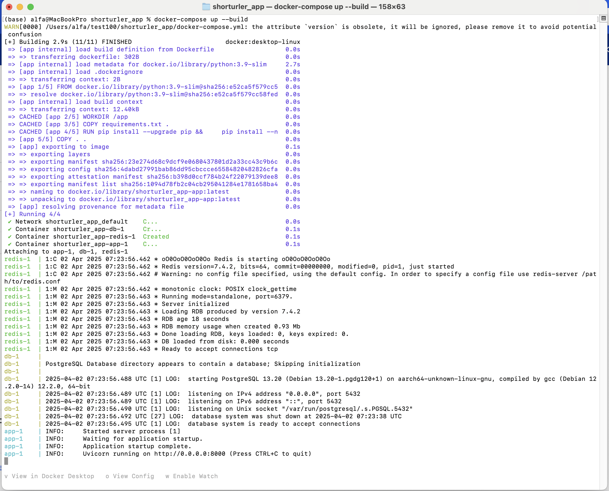
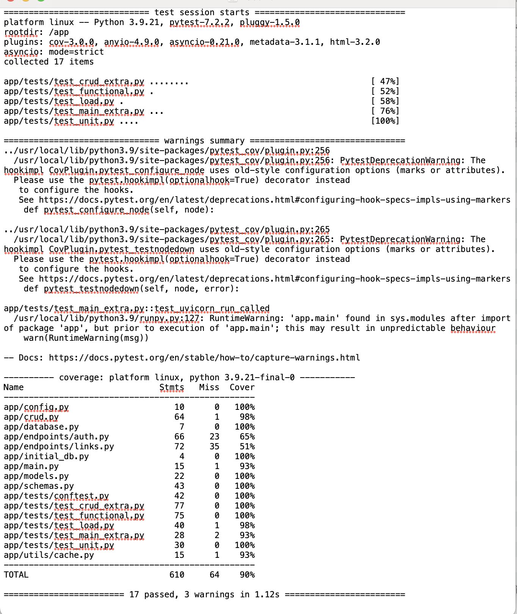

# Shorturler API

Сервис для сокращения ссылок с поддержкой регистрации, авторизации и персонального управления ссылками. 
Сервис развернут на render.com: https://shorturler-app.onrender.com (открывается под VPN)

## Описание API

### Authentication
- `POST /auth/register` — регистрация нового пользователя
- `POST /auth/token` — получение JWT-токена по username и password
- `GET /auth/me` — информация о текущем пользователе (по токену)

### Links
- `POST /links/shorten` — создание короткой ссылки (авторизованно или анонимно)
- `GET /links/search?original_url=...` — поиск всех ссылок по оригинальному URL
- `GET /links/{short_code}/stats` — статистика по ссылке (переходы, дата и т.д.)
- `GET /links/{short_code}` — редирект на оригинальную ссылку
- `PUT /links/{short_code}` — обновление ссылки (только для владельца)
- `DELETE /links/{short_code}` — удаление ссылки (только для владельца)

## Примеры запросов

### 1. Регистрация пользователя
```http
POST /auth/register
Content-Type: application/json

{
  "username": "testuser",
  "password": "secret"
}
```
### 2. Получение токена
```bash
POST /auth/token
Content-Type: application/x-www-form-urlencoded

grant_type=&username=testuser&password=secret&scope=&client_id=&client_secret=
```
### 3. Создание короткой ссылки
```http
POST /links/shorten
Authorization: Bearer <your_token>
Content-Type: application/json

{
  "original_url": "https://example.com",
  "custom_alias": "myalias"
}
```

## Инструкция по запуску
```bash
git clone https://github.com/evgenkry/shorturler_app.git
cd shorturler_app
docker-compose up --build
```
После запуска API будет доступен по адресу: http://localhost:8000/docs (Swagger)



## Описание базы данных
### Таблица `users`

| Поле             | Тип         | Описание             |
|------------------|-------------|----------------------|
| `id`             | Integer     | ID пользователя      |
| `username`       | String(50)  | Имя пользователя     |
| `hashed_password`| String(255) | Хэш пароля           |
| `created_at`     | DateTime    | Дата регистрации     |

### Таблица `links`

| Поле              | Тип         | Описание                       |
|-------------------|-------------|--------------------------------|
| `id`              | Integer     | ID ссылки                      |
| `original_url`    | Text        | Оригинальный URL               |
| `short_code`      | String(50)  | Короткий код                   |
| `created_at`      | DateTime    | Дата создания                  |
| `redirect_count`  | Integer     | Количество переходов           |
| `last_accessed_at`| DateTime    | Дата последнего перехода       |
| `expires_at`      | DateTime    | Срок действия (опционально)    |
| `owner_id`        | Integer     | ID владельца (может быть null) |

## Тесты
### Виды тестов
Находятся в папке app/tests

- conftest.py - фикстуры
- test_unit.py - юнит-тесты
- test_crud_extra.py - тесты CRUD
- test_functional.py - функциональные тесты
- test_load.py - нагрузочные тесты
- test_main_extra.py - тест запуска и базовых эндпоинтов

### Запуск тестов
После клонирования репозитория и сборки приложения в Docker выполнить:
```bash
cd shorturler_app
docker-compose run --rm app pytest --cov=app --cov-report=term-missing
```
### Результаты тестов
Приведены ниже, а также в файле results.txt



